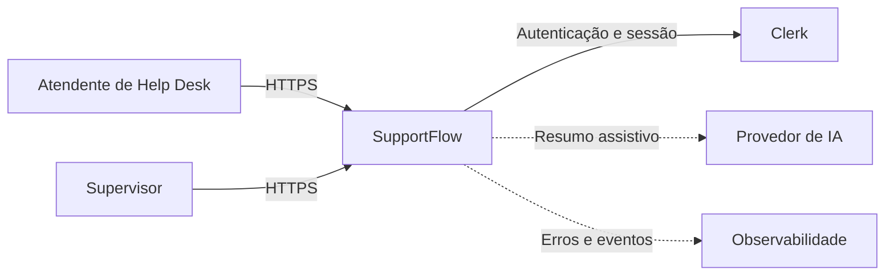
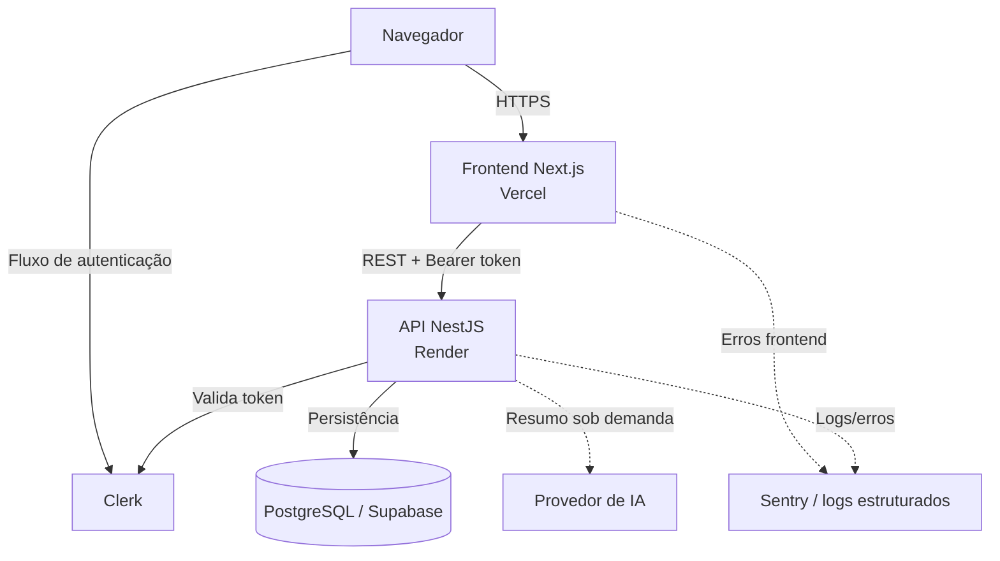
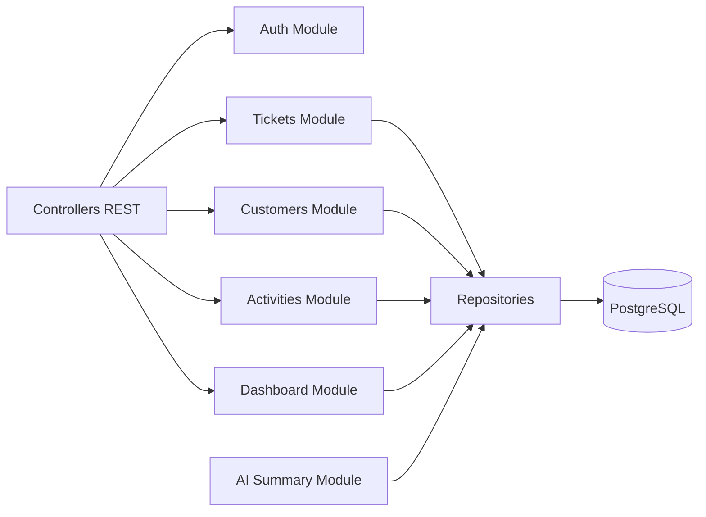
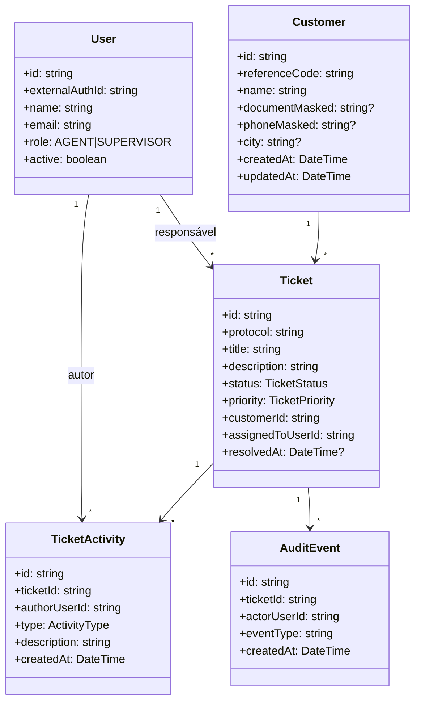
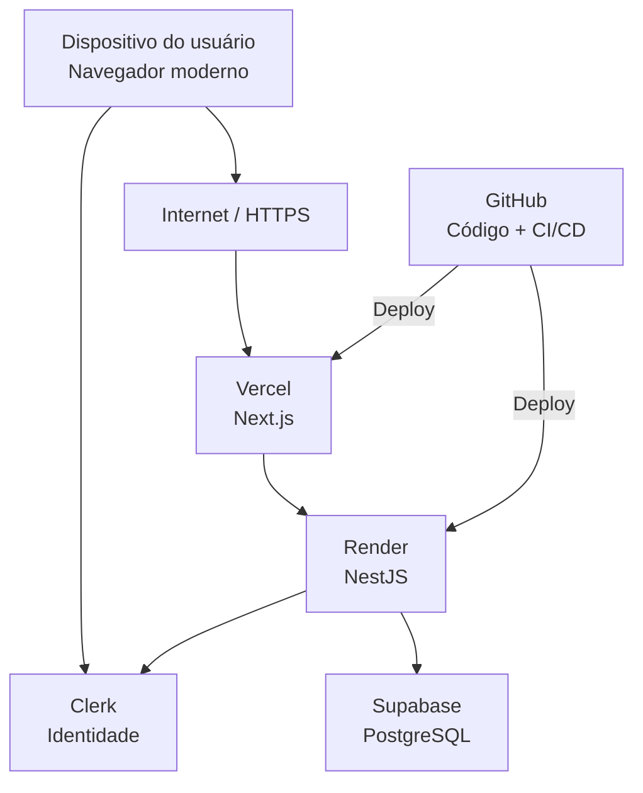

# Modelos de Arquitetura — SupportFlow

Este documento complementa `docs/architecture.md` com os modelos solicitados no regulamento da disciplina.

## 1. Modelo de Contexto

O SupportFlow é uma aplicação web interna. Clerk é a fonte externa de identidade; regras de perfil e autorização permanecem no domínio da aplicação.

## 2. Modelo de Contêineres

## 3. Modelo de Componentes do Backend

As regras de negócio ficam nos serviços do backend. O frontend nunca acessa o banco diretamente.

## 4. Modelo de Classes do Domínio

## 5. Modelo de Implantação

## 6. Restrições e decisões

- comunicação externa somente por HTTPS;
- API versionada sob `/api/v1`;
- segredos somente no backend e em variáveis de ambiente;
- dados acadêmicos exclusivamente fictícios;
- autenticação externa via Clerk, autorização interna via SupportFlow;
- persistência relacional em PostgreSQL;
- frontend sem acesso direto ao banco;
- IA será assistiva e não poderá alterar estado do chamado automaticamente.
