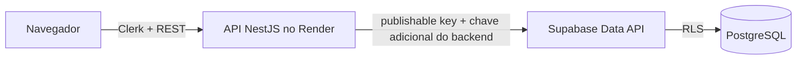

# Supabase — Persistência da V3

## Objetivo

A V3 introduz persistência relacional real para clientes, chamados, atividades técnicas e auditoria.

O projeto Supabase utilizado pelo SupportFlow está na região `sa-east-1` e contém apenas dados fictícios de demonstração.

## Estrutura persistida

Tabelas públicas:

- `customers`;
- `tickets`;
- `ticket_activities`;
- `audit_events`.

Todas as tabelas expostas pela Data API possuem **Row Level Security (RLS)** habilitado.

## Fluxo de acesso

O navegador não recebe credenciais do banco. O frontend fala somente com a API NestJS.

## Proteção adicional

O backend utiliza:

- `SUPABASE_URL`;
- `SUPABASE_PUBLISHABLE_KEY`;
- `SUPABASE_BACKEND_KEY`.

A chave adicional do backend não é versionada e existe somente no ambiente seguro do Render e no schema privado do banco.

O PostgREST executa uma função de pre-request em `private.check_request()`. Requisições no papel `anon` sem a chave adicional válida são bloqueadas antes de acessar as tabelas.

## RLS e permissões

As policies permitem somente as operações necessárias ao backend:

- clientes: leitura, criação e atualização;
- chamados: leitura, criação e atualização;
- atividades: leitura e criação;
- auditoria: leitura e criação.

Não há exclusão física de chamados no MVP.

## Auditoria

Triggers PostgreSQL registram:

- criação do chamado;
- mudança de status;
- mudança de prioridade;
- mudança de responsável;
- resolução;
- inclusão de atividade técnica.

## Dados de demonstração

O seed adiciona apenas registros identificados como `DEMO-001`, `DEMO-002` e outros dados claramente fictícios.

Nenhum dado real de assinante deve ser utilizado.

## Verificação de segurança

Após as migrations, o Supabase Database Advisor foi executado.

Resultado final de segurança:

- **0 lints de segurança**.

Os avisos de performance sobre índices ainda não utilizados são esperados em um banco recém-criado com volume mínimo de dados e não justificam a remoção dos índices planejados para busca e filtragem.

## Migrations

- `20261003_001_customers.sql`;
- `20261003_002_tickets.sql`;
- `20261003_003_backend_api_security.sql`;
- `20261003_004_security_hardening.sql`.

O valor real de `SUPABASE_BACKEND_KEY` é provisionado fora do Git e nunca deve aparecer em documentação, código ou prints.
