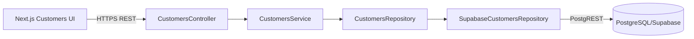

# Design — Change 03 Customer Management

## Contexto

A autenticação e autorização já estão separadas da persistência de domínio. A Change 03 introduz o primeiro agregado persistente do produto: `Customer`.

## Decisão de persistência

O banco é PostgreSQL gerenciado pelo Supabase. Nesta change, o backend conversa com o banco por meio do endpoint REST/PostgREST do Supabase.

Essa escolha mantém a camada web desacoplada da persistência e não adiciona dependências de runtime ao monorepo. A camada de repositório continua abstrata, permitindo substituir a implementação por um cliente SQL/ORM em uma evolução posterior sem alterar controllers e serviços.

## Componentes

## Modelo

`Customer` contém:

- `id`: UUID gerado pelo banco;
- `referenceCode`: identificador funcional único;
- `name`: nome de demonstração;
- `documentMasked`: opcional e mascarado;
- `phoneMasked`: opcional e mascarado;
- `city`: opcional;
- `createdAt` e `updatedAt`.

## Segurança

- todos os endpoints de clientes são protegidos pelos guards globais;
- a service role do Supabase existe apenas no backend;
- o frontend recebe somente os dados de cliente retornados pela API;
- o banco possui RLS habilitado;
- o ambiente acadêmico usa somente dados fictícios.

## Erros

- `400`: dados ou paginação inválidos;
- `401`: sessão ausente/inválida;
- `403`: usuário sem acesso ativo;
- `404`: cliente inexistente;
- `409`: `referenceCode` duplicado;
- `503`: persistência indisponível ou não configurada.

## Migração

A migration cria `public.customers`, restrição única em `reference_code`, timestamps e trigger de `updated_at`.

O seed adiciona somente registros identificados como demonstração.
