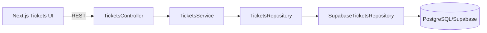

# Design — Change 04 Ticket Lifecycle

## Contexto

A Change 04 introduz o principal agregado de negócio do SupportFlow: o chamado técnico. Ela depende de um cliente persistido e utiliza o usuário autenticado como criador e responsável inicial.

## Componentes

## Regras centrais

- estado inicial `OPEN`;
- protocolo gerado no banco no formato `SF-YYYY-NNNNNN`;
- prioridade obrigatória;
- cliente deve existir;
- usuário criador assume o chamado;
- transições de status ficam centralizadas no serviço;
- resolução usa ação própria e exige texto;
- reabertura de `RESOLVED` para `DIAGNOSING` exige supervisor.

## Persistência e auditoria

A migration cria `tickets` e um trigger de auditoria. Mudanças de status, prioridade, responsável e resolução registram eventos em `audit_events`.

O trigger de protocolo usa uma sequence PostgreSQL para evitar geração concorrente duplicada.

## Segurança

Todas as rotas estão sob os guards globais de autenticação e autorização. O role confiável continua sendo o role interno do SupportFlow, nunca uma claim enviada pelo navegador.
