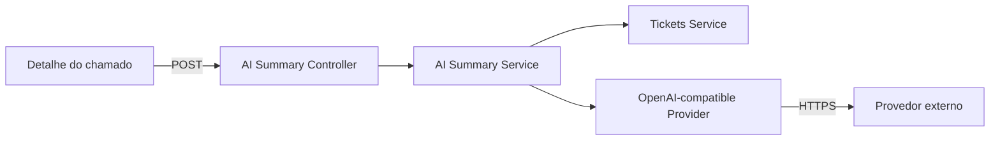

# Design — Change 07 AI Ticket Summary

## Objetivo

Reduzir o tempo de leitura de chamados longos sem delegar decisões operacionais ao modelo.

## Arquitetura

## Contexto enviado

Somente informações já registradas no chamado:

- protocolo e cliente fictício;
- título e descrição;
- categoria, status e prioridade;
- resolução, quando existente;
- até 30 eventos mais recentes da linha do tempo.

Claims, cookies, headers, chaves e dados de autenticação não entram no prompt.

## Provider

A integração usa contrato compatível com Chat Completions e é configurada por:

- `AI_PROVIDER_URL`;
- `AI_API_KEY` ou `OPENROUTER_API_KEY`;
- `AI_MODEL`.

Sem credencial o endpoint retorna `503`, preservando integralmente o fluxo normal do atendimento.

## Segurança funcional

O serviço não chama métodos de alteração de chamado. A resposta possui aviso explícito de revisão humana e nunca altera status, prioridade, responsável, diagnóstico ou resolução.
