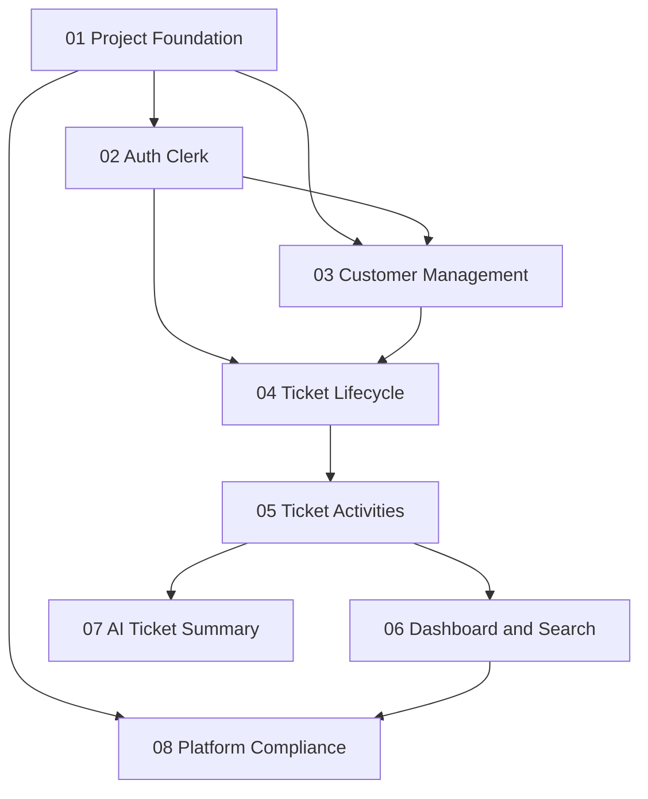

# Roadmap de Implementação Incremental — SupportFlow

Plano de mudanças da entrega incremental v2 e evolução subsequente. Todas as mudanças foram dimensionadas para tamanho, complexidade e risco no máximo **Médio**, conforme orientação do roteiro de Delivery.

## Estrutura de dependências



## Resumo do planejamento

| # | Change | Escopo funcional | Tam. | Dependências | Lint | Unitários | Integração | E2E/Aceite | Status |
|---|---|---|:---:|---|:---:|:---:|:---:|:---:|---|
| 01 | Project Foundation | npm workspaces, Next.js, NestJS, health check, CI base | P | — | Sim | Sim | Sim | Não | Implementada |
| 02 | Auth Clerk | login, sessão, validação de token e RBAC AGENT/SUPERVISOR | M | 01 | Sim | Sim | Sim | Sim | Implementada, validada e arquivada |
| 03 | Customer Management | cadastro e consulta de clientes fictícios | P | 01, 02 | Sim | Sim | Sim | Sim | Planejada |
| 04 | Ticket Lifecycle | criar chamado, protocolo, status, prioridade e resolução | M | 02, 03 | Sim | Sim | Sim | Sim | Planejada |
| 05 | Ticket Activities | testes, diagnósticos, reatribuição e linha do tempo | M | 04 | Sim | Sim | Sim | Sim | Planejada |
| 06 | Dashboard and Search | resumo operacional, busca, filtros e paginação | M | 05 | Sim | Sim | Sim | Sim | Planejada |
| 07 | AI Ticket Summary | resumo assistivo do histórico técnico, sem diagnóstico autônomo | M | 05 | Sim | Sim | Sim | Sim | Planejada |
| 08 | Platform Compliance | observabilidade, containers OCI, automação e IaC | M | 01, 06 | Sim | Sim | Sim | Sim | Planejada |

**Legenda:** P = pequeno; M = médio.

## Ordem de execução recomendada

```text
Fase 1 — Fundação
  └─ change-01-project-foundation ✅

Fase 2 — Identidade
  └─ change-02-auth-clerk ✅

Fase 3 — Dados básicos
  └─ change-03-customer-management

Fase 4 — Fluxo principal
  ├─ change-04-ticket-lifecycle
  └─ change-05-ticket-activities

Fase 5 — Operação
  └─ change-06-dashboard-and-search

Fase 6 — Recurso tecnológico adicional
  └─ change-07-ai-ticket-summary

Fase 7 — Conformidade de plataforma
  └─ change-08-platform-compliance
```

## Fluxos ponta a ponta obrigatórios

### Fluxo A — Atendimento completo

Login → cliente → abertura de chamado → teste → diagnóstico → mudança de status → resolução → histórico.

Changes principais: `02`, `03`, `04`, `05`.

### Fluxo B — Escalonamento e continuidade

Login → consulta do chamado → atividade técnica → escalonamento → reatribuição por supervisor → continuidade do diagnóstico → resolução/reabertura → histórico.

Changes principais: `02`, `04`, `05`.

## Recurso tecnológico adicional

A `change-07-ai-ticket-summary` adicionará **IA assistiva** para produzir um resumo do contexto técnico registrado no chamado. O resultado será apresentado como sugestão e não substituirá diagnóstico, autorização ou decisão humana.

## Critérios de qualidade aplicáveis a todas as mudanças

- linter/verificação estática sem erros;
- build reproduzível;
- testes unitários para regras de negócio;
- testes de integração para APIs e persistência introduzidas;
- testes Playwright para fluxos completos quando houver interface relevante;
- Happy Path, Sad Path e Edge Cases nas regras críticas;
- segredos somente por variáveis de ambiente;
- nenhum dado real de assinante no ambiente acadêmico;
- documentação atualizada quando a mudança alterar contrato, arquitetura ou fluxo.

## Status na v2

### Implementadas

- `change-01-project-foundation`: estrutura inicial do monorepo, frontend Next.js, backend NestJS, health check, testes e CI base.
- `change-02-auth-clerk`: autenticação Clerk, sessão, proteção de rotas, validação de token no backend, associação com usuário interno, papéis `AGENT`/`SUPERVISOR`, usuário inativo, logout e tratamento de `401`/`403`.

A `change-02-auth-clerk` foi validada com Playwright, com resultado final de **8 testes E2E aprovados**, e arquivada em:

`openspec/changes/archive/2026-09-14-change-02-auth-clerk/`

Sua especificação consolidada está em:

`openspec/specs/auth-clerk/spec.md`

### Planejadas

- `change-03-customer-management`
- `change-04-ticket-lifecycle`
- `change-05-ticket-activities`
- `change-06-dashboard-and-search`
- `change-07-ai-ticket-summary`
- `change-08-platform-compliance`

O desenvolvimento continuará seguindo o ciclo incremental do OpenSpec: proposta → implementação → verificação → arquivamento.